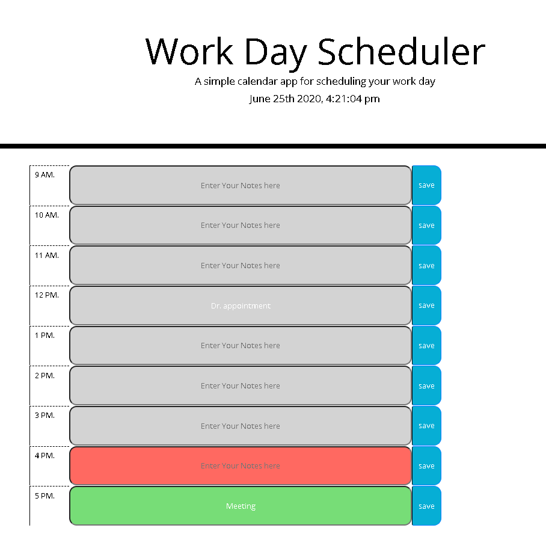

## 05 Third-Party APIs: Work Day Scheduler

Work Day Scheduler is an application that helps the user to save events for each hour of the day. This mainly focused on dynamically updated webpage powered by jQuery. Also, the library [Moment.js](https://momentjs.com/) is used mostly to display the date and time on our page. This website is made responsive by using media queries.

## Application

* The user can add the events to the daily planner to manage their time efficiently.
* The user opens the daily planner.
* They can see the current date at the top of the calendar.
* Time blocks are present for the business hours, and also, the time block is color-coded to indicate whether it is in the past, present, or future.
* The user can click on the time block to enter an event.
* Then click on "save" to save the event.
* The event details are stored in local storage.
* Even on refreshing the page, the saved event should persist.

## Implementation

* The files are index.html, script.js, style.css.
* Mostly, the code is written in script.js as this is a dynamically updated webpage.
* Moment.js library is used for getting the current date and also for getting the hour to set/change the time block color.
* On clicking the "save" button, get the entered text and its data-value. 
* Depending on this data-value, the entered text is being stored in local storage.
* All the values are retrieved from localStorage and displayed on the screen. By this, even on refreshing the page, the saved details persist.
* Also included media queries to make it more responsive.

#### Screenshots

Here's the link to my developed Website : [ThirdPartyAPIs - WorkDayScheduler](https://yakinia.github.io/05-ThirdPartyAPIs-WorkDayScheduler)

##### References

StackOverflow-DateFunction : [DateFunction](https://stackoverflow.com/questions/31593445/moment-js-get-yesterday-time-range-from-midnight-to-midnight) 
W3Schools-JQueryFunctionality: [jQueryFunction](https://www.w3schools.com/jquery/tryit.asp?filename=tryjquery_dom_html_set) 
Blog-LocalStorage : [LocalStorage](https://www.taniarascia.com/how-to-use-local-storage-with-javascript/) 
LocalStorage-Javascript: [LocalStorage](https://medium.com/better-programming/how-to-use-local-storage-with-javascript-9598834c8b72) 
Moment.js- Date : [Moment.js](https://momentjs.com/)
